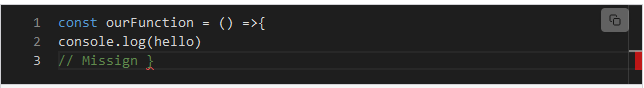
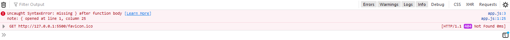
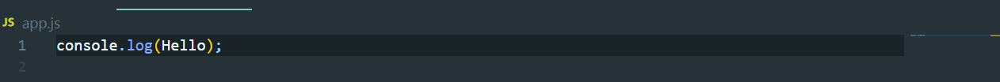
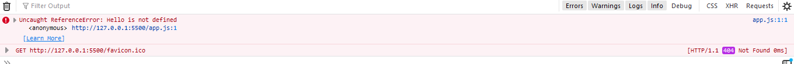
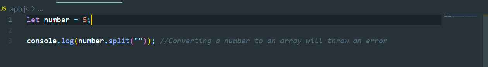
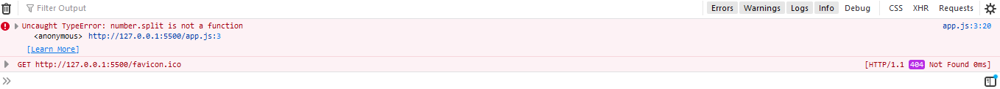
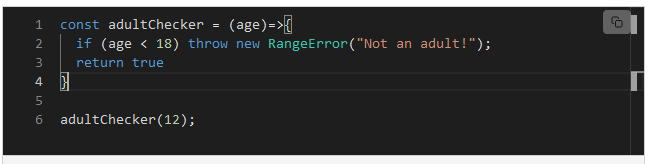
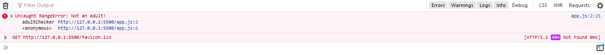
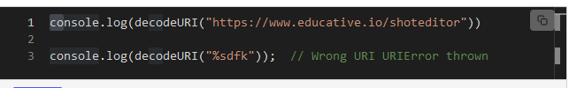
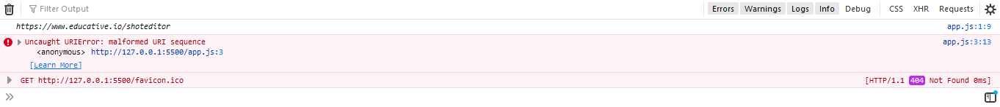

# Type-of-Error-JavaScript

   

     In any programming language, errors occur. There are basically two types of errors in 
     
     programming. These are:

     Program Error:

     This is an error encountered by the program that might require error handlers to manage. 
     
     An example could be network disconnection, timeout error, HTTP response errors, etc.
     
     Developer Error:
     
     This is an error caused by the programmer. Examples include syntax errors, logical errors, 
     
     semantic errors, etc.

     Errors are statements that don't let the program run properly. There are several  main 
     
     types of errors that can occur while compiling a JavaScript program:

### Syntax error

     Syntax error (SyntaxError): This is done when you use an already pre-defined syntax in the 
     
     wrong way.Some common causes of a SyntaxError are:

         Missing opening or closing brackets, braces, or parentheses
         
         Missing or invalid semicolons
         
         Misspelling of variable names or functions

     Run the code below to see a syntax error. It will be thrown because there are no 
     
     closing braces ‘}’ for the function. We can see this here:

   ;
  
   ;
### Reference Error

     In essence, a reference error occurs when JavaScript tries to access a variable that 
     
     doesn’t exist, hasn’t been defined, or doesn’t exist in the current scope from which you 
     
     are trying to access it. Run the code below to see the type of error it logs:

   ;

   ;
### Type Error

     If I ask you to give me the result of the addition of 1 plus H will you be able to give me 
     
     the answer?  The obvious answer is NO.

     The same goes in JavaScript! If you add 1 and H in JavaScript or when you try to perform 
     
     operations on two operands of unmatched types, JavaScript throws a TypeError.We can 
     
     represent this in the following way:

   ;

   ;

### RangeError

     RangeError (RangeError()): This error is caused when there is a need for an expected range 
     
     of values, as shown below:
    
     Ошибка диапазона (Ошибка диапазона ()): Эта ошибка возникает, когда требуется ожидаемый 
     
     диапазон значений, как показано ниже:

   ;
    
   ;
### URI Error

     A Uniform Resource Locator (URL) is what leads/ведет you to a page or file on the 
     
     internet. URLs serve as the addresses of things on the internet.When you pass a string to 
     
     the URL constructor, it returns a new URL object if a string is a valid URL. Otherwise, it 
     
     returns an error: This is called whenever a wrong character(s) is used in any URI 

   ;
   
   ;
