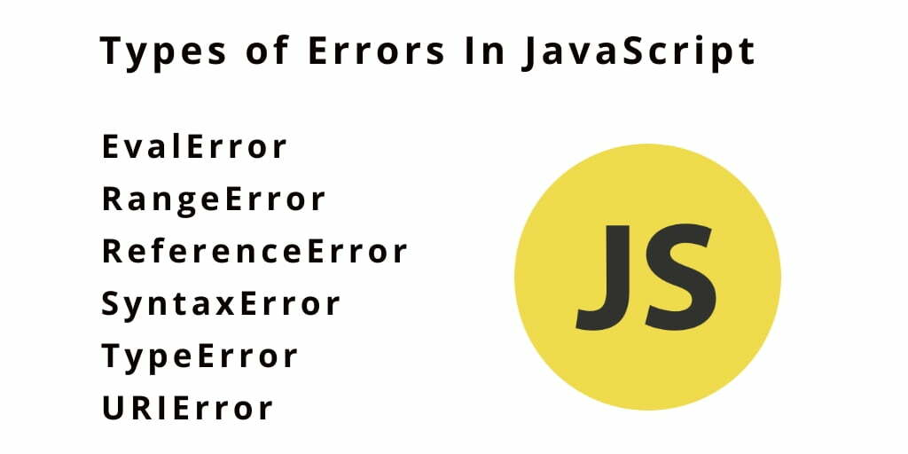

# Type-of-Error-JavaScript

    

     In any programming language, errors occur. There are basically two types of errors in 
     
     programming. These are:

     Program Error:

     This is an error encountered by the program that might require error handlers to manage. 
     
     An example could be network disconnection, timeout error, HTTP response errors, etc.
     
     Developer Error:
     
     This is an error caused by the programmer. Examples include syntax errors, logical errors, 
     
     semantic errors, etc.

     Errors are statements that don't let the program run properly. There are several  main 
     
     types of errors that can occur while compiling a JavaScript program:

### Syntax error

     Syntax error (SyntaxError): This is done when you use an already pre-defined syntax in the 
     
     wrong way.Run the code below to see a syntax error. It will be thrown because there are no 
     
     closing braces ‘}’ for the function. We can see this here:

   ;
  
   ;
### Reference Error

     Reference Error (ReferenceError): this occurs when a variable reference can’t be found or 
     
     is not declared. Run the code below to see the type of error it logs:

   ;

   ;
### Type Error

     Type Error (TypeError()): This is an error caused by misusing a value outside its own data 
     
     type scope. We can represent this in the following way:

   ;

   ;

### RangeError

     RangeError (RangeError()): This error is caused when there is a need for an expected range 
     
     of values, as shown below:
    
     Ошибка диапазона (Ошибка диапазона ()): Эта ошибка возникает, когда требуется ожидаемый 
     
     диапазон значений, как показано ниже:

   ;
    
   ;
### URI Error

     URI Error(URIError()): This is called whenever a wrong character(s) is used in any URI 
     
     function. A sample of this is shown below:

   ;
   
   ;
